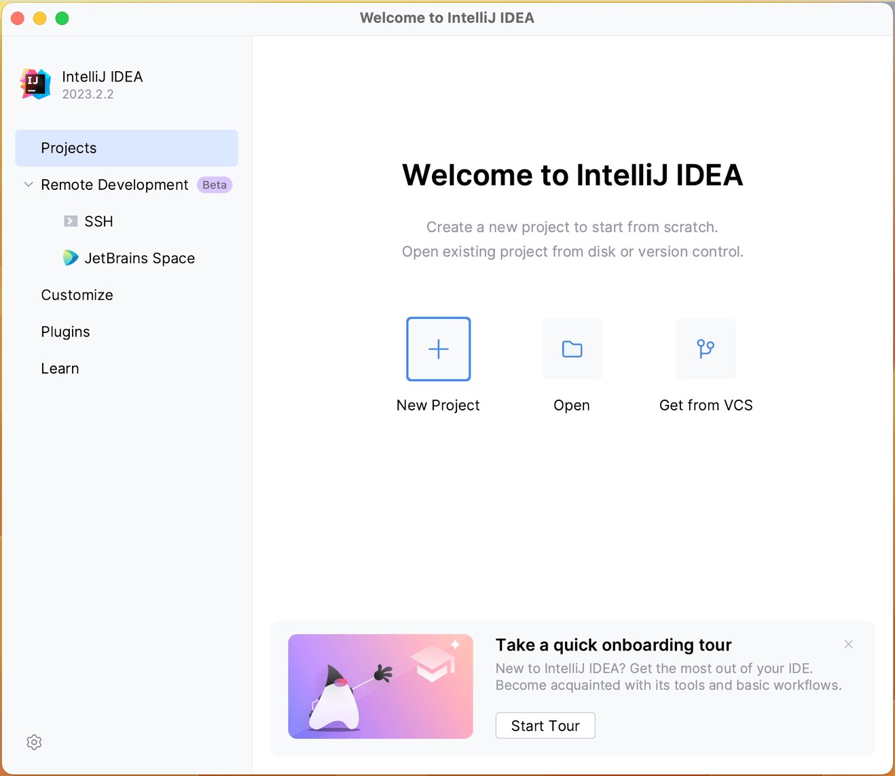
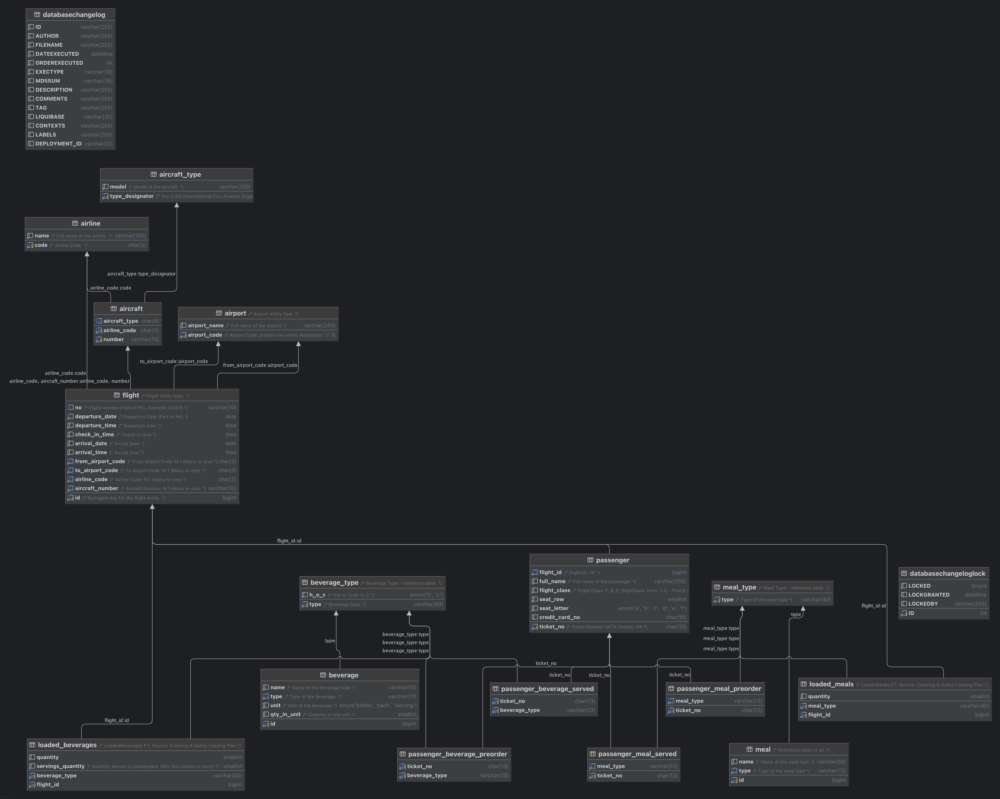

# LAB-11: Database system development (Flights Catering domain)

You can treat this project as a template for your own project. You can use the same structure and adapt it to your needs.

## 1. How to build a project?

### 1.1. Prerequisites

- Install [IntelliJ IDEA](https://www.jetbrains.com/idea/download/)
  - You can use the Community edition, but the Ultimate edition is recommended. You can use your student license for it.
- Install [Java 21] https://adoptium.net/temurin/releases/
  - Another option: https://sdkman.io/. Sdkman is a tool for managing parallel versions of multiple Software Development Kits on most Unix-based systems. Refer to this page for installation instructions: https://sdkman.io/usage/
- Install [Gradle] (*Optional*) https://gradle.org/install/
  - You can use Sdkman to install Gradle as well.
- Install [MySQL] https://dev.mysql.com/downloads/mysql/
  - or using Docker: `docker run --name mysql -e MYSQL_ROOT_PASSWORD=root MYSQL_DATABASE=<database_name_of_your_choice> -p 3306:3306 -d mysql:lts`

### 1.2. Clone and open the project

```bash
git clone git@github.com:stanislav-pavliuk/flights-db-hw-3.git
```

or you can use the option `Get from VCS` in IntelliJ IDEA.



Open the project in IntelliJ IDEA using the `Open` option.

Now you can build the sources using either `./gradlew build` command or using the `Build` option in IntelliJ IDEA.

### 1.3. Run the project

First of all, you need to create database. Use:

```sql
CREATE DATABASE inflight_catering_service; -- or any other name you want
```

Now, open the `src/main/resources/application.properties` file and change the `spring.datasource.url` property to your database name. For example:

```properties
spring.datasource.url=jdbc:mysql://localhost:3306/inflight_catering_service
spring.datasource.username=<your_username>
spring.datasource.password=<your_password>
```

Then you can run the project using the `./gradlew bootRun` command or using the `Run` or `Debug` option in IntelliJ IDEA.

### 1.4. Verify

Open the following URL in your browser:

```
http://localhost:8080
```

# Database Schema


